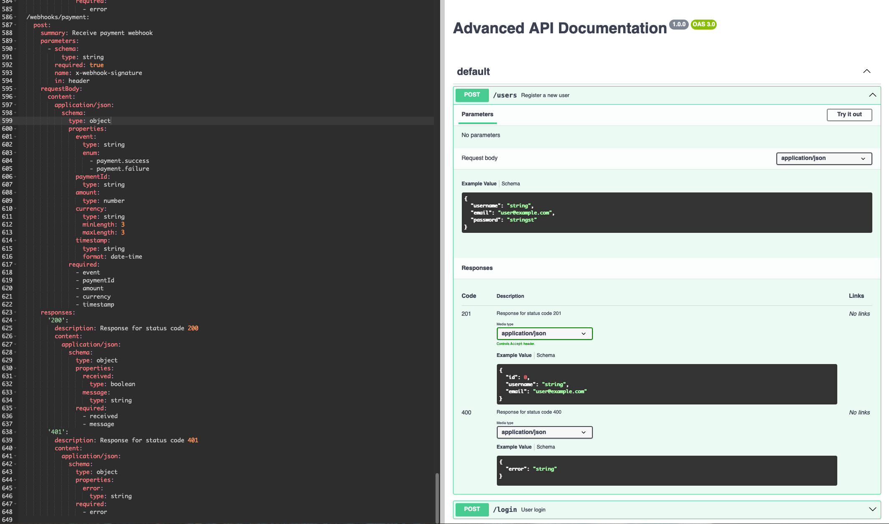
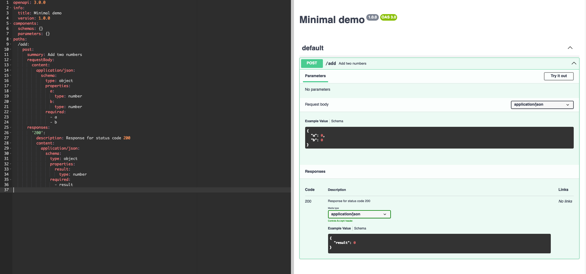
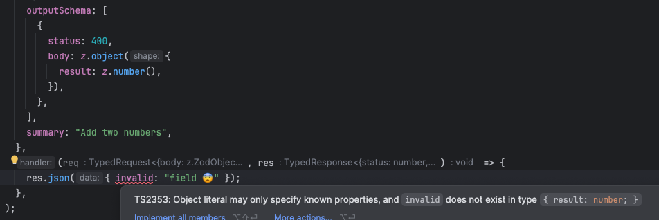
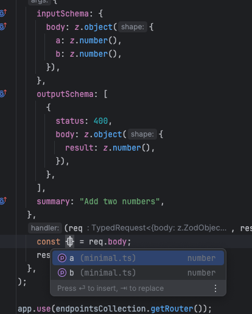

# express-endpoints-collection

## Description

This package provides easy to use helper for creating API endpoints in Express with TypeScript inference, validation and OpenAPI 3 schema out of the box.

No need to duplicate OpenAPI definitions in your codebase. Just define your API endpoints and automatically generate OpenAPI 3 schema.

You can configure exposed endpoints, request and response schemas, and validation rules.



For support of zod v3 and express v4 use 1.0.28

## Features

- Fully typed endpoints (TypeScript hints and checks) for Express v5
  - Request body
  - Response body
  - Query parameters
  - Path parameters
  - Headers
- Automatic OpenAPI 3.0 schema generation
- Request and response validation using Zod v4
- Full middleware support
- Minimal setup

## Installation

```shell
npm install express-endpoints-collection

# or

yarn add express-endpoints-collection

# or

pnpm add express-endpoints-collection
```

## Usage

```typescript
import express, { Express } from "express";
import bodyParser from "body-parser";
import { z } from "zod";
import { EndpointsCollection } from "express-endpoints-collection";
import { generateOpenAPI } from "express-endpoints-collection/generator";

// 1. Create express app
const app: Express = express();
app.use(bodyParser.json());

// 2. Create endpoints collection, this will store all your endpoints
const endpointsCollection = new EndpointsCollection();

// 3. Add new endpoint
endpointsCollection.post(
  "/add",
  {
    inputSchema: {
      body: z.object({
        a: z.number(),
        b: z.number(),
      }),
    },
    outputSchema: [
      {
        status: 200,
        body: z.object({
          result: z.number(),
        }),
      },
    ],
    summary: "Add two numbers",
  },
  // 4. req and res are fully typed!
  (req, res) => {
    const { a, b } = req.body;
    res.json({ result: a + b });
  },
);

// 5. Collection creates its own router, to use it just add it to your app
app.use(endpointsCollection.getRouter());

// 6. Expose OpenAPI 3 schema
app.get("/openapi", (req, res) => {
  res.setHeader("Content-Type", "text/yaml");
  res.send(
    generateOpenAPI({
      title: "Minimal demo",
      version: "1.0.0",
      endpoints: endpointsCollection.getEndpoints(),
      servers: ["http://localhost:3000"],
    }),
  );
});

// 7. Start the server and done!
app.listen(3000, () => {
  console.info(`Server is running on port http://localhost:3000`);
});
```

it will generate OpenAPI 3 definition as follow:

```yaml
openapi: 3.0.0
info:
  title: Minimal demo
  version: 1.0.0
components:
  schemas: {}
  parameters: {}
paths:
  /add:
    post:
      summary: Add two numbers
      requestBody:
        content:
          application/json:
            schema:
              type: object
              properties:
                a:
                  type: number
                b:
                  type: number
              required:
                - a
                - b
      responses:
        "200":
          description: Response for status code 200
          content:
            application/json:
              schema:
                type: object
                properties:
                  result:
                    type: number
                required:
                  - result
```

or as JSON

```json
{
  "openapi": "3.0.0",
  "info": {
    "title": "Minimal demo",
    "version": "1.0.0"
  },
  "components": {
    "schemas": {},
    "parameters": {}
  },
  "paths": {
    "/add": {
      "post": {
        "summary": "Add two numbers",
        "requestBody": {
          "content": {
            "application/json": {
              "schema": {
                "type": "object",
                "properties": {
                  "a": {
                    "type": "number"
                  },
                  "b": {
                    "type": "number"
                  }
                },
                "required": ["a", "b"]
              }
            }
          }
        },
        "responses": {
          "200": {
            "description": "Response for status code 200",
            "content": {
              "application/json": {
                "schema": {
                  "type": "object",
                  "properties": {
                    "result": {
                      "type": "number"
                    }
                  },
                  "required": ["result"]
                }
              }
            }
          }
        }
      }
    }
  }
}
```

## Example



Type inference and checks:





## Built-in middlewares

Import `z` from this package so request schemas use the same Zod instance the collection validates with.

```typescript
import {
  defineMiddlewares,
  EndpointsCollection,
  z,
} from "express-endpoints-collection";

const api = defineMiddlewares({
  customErrorHandler: (_error, details) => ({
    error: "ValidationError",
    details,
  }),
  middlewares: {
    requestLogger: { enabled: true },
    jwt: { secret: process.env.JWT_SECRET ?? "dev-secret" },
    cache: { stdTTL: 60, checkperiod: 120 },
    rateLimit: { windowMs: 60_000, limit: 30 },
    errorHandler: { enabled: true },
  },
});

const shops = new EndpointsCollection({
  collectionPrefix: "/shops",
  ...api,
});

const account = new EndpointsCollection({
  collectionPrefix: "/account",
  ...api,
  middlewares: {
    ...api.middlewares,
    jwt: { ...api.middlewares.jwt, enabled: true },
  },
});

shops.get(
  "/",
  {
    outputSchema: [{ status: 200, body: z.object({ ok: z.boolean() }) }],
    middlewares: { cache: true, rateLimit: { limit: 10 } },
  },
  (_req, res) => {
    res.json({ ok: true });
  },
);
```

Collection `jwt: { secret }` with `enabled` omitted is settings only; routes stay open until they set `jwt: true` or a partial such as `jwt: { required: false }`. Collection `enabled: true` applies that middleware to every route unless the route sets `false`. The same rules apply to `requestLogger`, `cache`, `rateLimit`, and `errorHandler`. Per-route `cache: true` or `rateLimit: { limit: 10 }` still opt in when collection `enabled` is omitted.

Replacing `jwt` with `{ enabled: true }` drops `secret`. Spread the preset first: `jwt: { ...api.middlewares.jwt, enabled: true }`.

Other middleware still goes on `beforeInputValidation`, `afterInputValidation`, or `beforeResponse`. A cache hit returns before `beforeInputValidation`, so that hook does not run for a stored response. A per-route `checkperiod` is ignored. `stdTTL` on a route is the TTL for that route's cache entries. Client options such as `checkperiod` belong on the collection.

## License

This software is licensed under the GNU Affero General Public License v3.0. See [LICENSE](LICENSE).

Anyone may use it under AGPLv3, including in a commercial product, if they comply with that license.

For a written license without AGPL copyleft, contact the author on [GitHub](https://github.com/pilotpirxie). Until that agreement exists, AGPLv3 applies.
